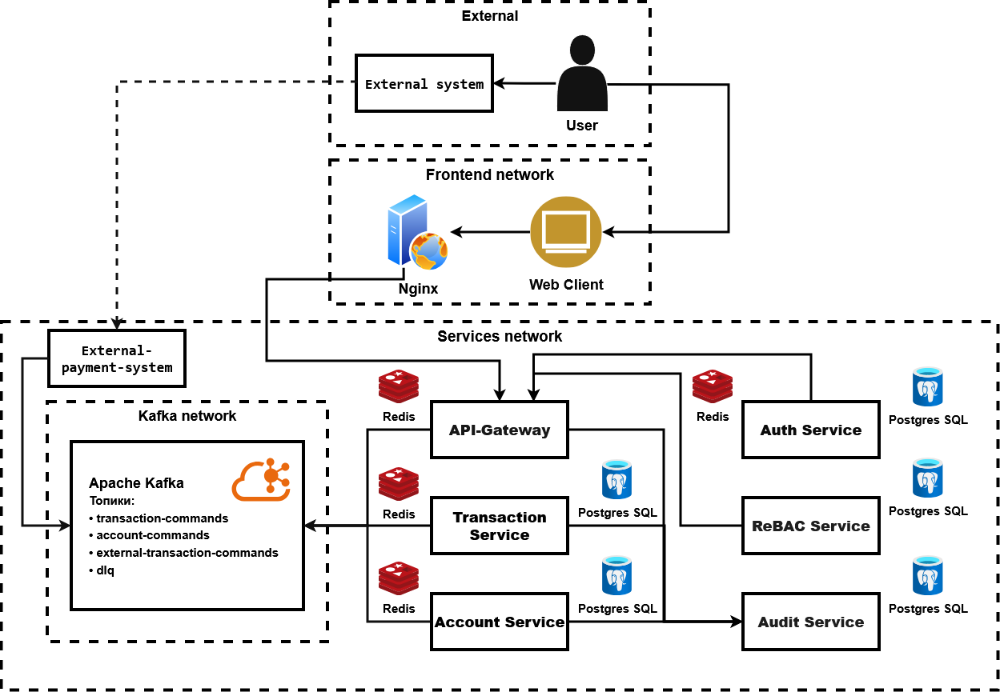

# Finance System
Микросервисная платежная система
> [!WARNING]
> Проект ещё находится в активной разработке и не все представленные функции реализованы

## Содержание

- [Архитектура проекта](#архитектура-проекта)
  - [Transaction Service](#transaction-service)
  - [Account Service](#account-service)
  - [Currency Service](#currency-service)
  - [External Payment Service](#external-payment-service)
  - [Audit Service](#audit-service)
  - [API Gateway](#api-gateway)
  - [Auth Service](#auth-service)
  - [ReBAC Service](#rebac-service)
- [Схема транзакций](#схема-транзакций)
  - [Внутренний платёж](#внутренний-платёж)
  - [Исходящий платёж](#исходящий-платёж)
  - [Входящее пополнение](#входящее-пополнение)
  - [Топики Kafka](#топики-kafka)
- [Отказоустойчивость, идемпотентность, масштабируемость](#отказоустойчивость-идемпотентность-масштабируемость)
- [Дальнейшие планы](#дальнейшие-планы)

## Архитектура проекта

### Transaction service
Основа проекта - сервис Transaction, который запускает сагу проведения платежа. Основная идея - сделать сервис максимально независимым и масштабируемым. Так я пришёл к хореографии саги. Transaction не знает полный маршрут саги - он только реагирует на каждое входящеем событие, принимает решение и передаёт управление дальше. Собственно платёж собирается как цепочка несвязанных шагов, и при сбое на каком-то этапе запускается обратная цепочка - компенсаций.

Такое решение позволяет легко масштабировать Transaction за счёт слабой связанности, а взамен необходимо строго обеспечить идемпотентность и тщательно обработать каждую возможную точку отказа. Так, в случае невозможности по какой-то причине откатить транзакцию, система обязана заблокировать счёт пользователя и делегировать проблему на ручное управление. В таком случае задача стоит спроектировать систему так, чтобы она была отказоустойчивой, могла самовосстанавливаться, а последняя линия обороны гарантированно срабатывала.

### Account service
Не менее важная часть системы, которая управляет балансом в конкурентной асинхронной среде. Когда несколько платежей пытаются одновременно изменить один и тот же счёт, Account Service гарантирует, что двойного списания не произойдёт. Это достигается за счёт поэтапного изменения баланса. Для этого баланс разделён на три части: balance — доступный пользователю остаток; frozen_balance — замороженные средства, которые транзакция «застолбила» для списания; и reserve_balance, который реализует тот же механизм, но для пополнений. Это позволяет так сказать «предсписать» или «предпополнить» средства, и безопасно работать с уже зарезервированными суммами, не блокируя счёт для других транзакций, а также гарантирует возможность отката без доступа к средствам незавершённой транзакции.

### Currency service
Пока отсутствует даже на схеме. Хотелось бы мне добавить возможность совершения платежей в разных валютах, но в других сервисах я посчитал эта фича нарушит принцип единой ответственности. А как отдельный сервис, я пока не придумал реализацию, которая оправдает создание целого отдельного сервиса под это в небольшом Pet-проекте. Но я займусь этим, как будет время. Из идея - сделать активный парсинг курса валют из какого-нибудь общедоступного веб сервиса, и заставить все это работать с ассинхронной транзакцией. Но подумаю, чтобы ещё можно было сюда прикрутить. 

### External-payment service
Я доконца и сам не определился, чем в моей системе задумывался этот сервис, толи иммитацией полноценного внешнего платежного шлюза, толи прослойкой между таким шлюзом и Transaction, дабы упаковать в подходящие модели все что пришло из вне и передать в Transaction удобным способом связи. Но по итогу, это простенький сервис с http ручкой создания платежа "из внешней системы" для тестирования Transaction, и методами которые участвуют в саге для платежей связанных с другой платежкой. Так, получая от Transaction сообщения с требованием подтвердить совершение операции или выполнить действия из цепочки на своей стороне, я просто возвращаю ответы, как если бы внешний платежный шлюз успешно бы обработал эти запросы(Или же не успешно, с чем мне помогает random). Я хотел приблизится к реальному формату обработки платежей, для чего использую ISO8583 формат и Stun идентификаторы, но по итогу, даже такая модель довольно условна, но позволяет протестировать саму логику распределенных транзакций в моем сервисе.

### Audit service
Думаю не нуждается в пояснении. И он ещё не реализован =)

### Api-gateway
Точка входа, которая безопасно дает доступ к сервисам. Ну пока ещё не безопасно, об этом ниже)

### Auth service
Сервис отвечающий за авторизацию и аутентификацию. Он уже был реализован в предыдущей версии проекта(где не было брокера сообщений, и были некоторые ошибки в архитектуре), и даже можно было бы посмотреть на реализацию в комите e55db54 от 21 августа 25 года, если бы я не использовал GitSubmoduls для своих микросервисов, и коммит не содержал лишь ссылку на репозиторий, который ныне до переработки закрыт. Собвтсенно дело было давно, но сервис использовал JWT токены, хешировал пароли, работал с Redis для создания BlackList для отзыва токенов. Собираюсь сделать его слабосвязанным, дабы можно было таскать его и по другим своим Pet-проектам. Хотя вернее будет сказать, хочу сделать либу для своих auth сервисов, чтобы быстро и просто разворачивать данный сервис в своих петах. Пока что в разработке.

### ReBAC service
Абсолютно такая же история как и с Auth сервисом. Сервис представляет собой реализацую управления ролями с помощью системы отношейний между субъектом и ресурсом. Выбран именно этот способ контроля доступа, т.к. я не хотел использовать сторонние либы, и в выборе подхода к реализации управления ролями этот показался самым интересным, менее душным, при этом в какой-то мере более продвинутым и сложным, так ещё и вполне не плохо ложился на мою систему. В разработке.

Веба пока что нет. Опять же он был в старом варианте. Как доберусь до него, так побалуюсь.

Собственно это пока что все сервисы, что предоставляет данный проектик. Есть и ещё идейки с чем я хотел бы поработать, и что дополнило бы его, но и до этого есть ещё незавршенные таски. 

## Схема транзакций

А основная соль проекта, как я считаю, именно в транзакции платежа. Ниже идёт общая схема саги для всех возможных вариантов палтежа. Она довольно громоздкая, но дает полоне представление о всей логике.

Для определения последующего этапа цепочки в транзакции достаточно лишь знать или тип отправителя или тип получателя(internal - счет находится в этой платежной системе или extrnal - счет находится в другой системе), в зависимости от операции, от которой необходимо продолжить цепочку. И действительно, если разобрать каждый этап транзакции, то направление каждого следующего этапа будет зависить лишь от SenderType или же RecipientType, а их комбинация приводит к конкретному типу платежа: внутряння транзакция: internal - internal (запрос на создание платежа идет от Api-gateway); транзакция в другую систему: internal - external (тут тоже запрос на создание платежа идет от Api-gateway); и транзакция из другой системы: external - internal (а здесь запрос на создание платежа идет от External-payment service). 

Собвственно "internal - internal" я рассматриваю как перевод, от инициатора, на другой счет. "internal - external" как перевод от инициатора в другую платежку. Именно перевод, я не рассматривал возможность "Затребовать" пополнение с другой платежки, хотя в реальных системах такое возможно - достаточно знать нужные данные, но в целом такая операция будет эквивалентна следующей рассмотренной, просто меняется инициатор. "external - internal" как пополнение, инициированное из вне. Тут та же история, что и с предыдущим типом, теоритически, мы можем рассмотреть external - internal как требование перевести из моей системы в другую, инициированное из вне, но такая операция так же будет эквивалентна "internal - external", просто поменяется сторона инициатора транзакции. Такие допущения я считаю вполне справедливыми для Pet проекта. Операция "external-external" не рассматривается, ибо и не касается системы, что логично.

### Внутренний платеж

Сначала замораживаем средства на счете отправителя, затем резервируем средства на счете получателя, если все успешно, осталось лишь "закомитить" изменения - окончательно списываем средства из замороженных у отправителя и закидываем на счет получателя из резерва, обновляем статус транзакции. Соотвественно если где-то ошибка, то запускаем цепочку компенсаций.

### Исходящий платёж

Замораживаем средства на счете отправителя, а затем стучимся во внешний шлюз с ISO 8583 сообщением(будто бы мы с каким-нибудь swift общаемся) дабы согласовать перевод, и они соответственно зарезервировали пополнение у себя или выполнили необходимые действия их системы, получаем ответ от них, идем "стирать" деньгу со счета отправителя и отправляем коммит во вне, что все успешно - можете "рисовать" деньгу на счете получателя. Под этим подразумевается, что за кулисами проекта пройдет магия работы коррекционных счетов.

### Входящее пополнение

Получаем запрос на пополние счета и идем резервировать средства, если все успешно, то спрашиваем, подтверждает ли внешняя система перевод, зачисляем деньги из резерва, сообщаем во вне, что все успешно и завршаем транзакцию

## Топики Kafka
transaction-commands — основной топик для управления транзакциями. Transaction Service слушает его и получает события на создание платежа и на ответы от Account и External Payment. Account Service слушает команды на работу с балансом и отвечает в этот же топик. External Payment слушает запросы на внешние операции и тоже отвечает сюда. API Gateway пишет в этот топик события на создание платежа.

account-commands — топик для команд, адресованных Account Service. Transaction Service пишет сюда запросы на заморозку, разморозку, резервирование, списание, пополнение и блокировку счёта. Account Service слушает этот топик и обрабатывает входящие команды.

external-transaction-commands — топик для команд, адресованных External Payment Service. Transaction Service пишет сюда запросы на внешний перевод, подтверждение и откат. External Payment Service слушает этот топик и обрабатывает входящие команды.

Dead Letter Queue — отдельный топик, куда попадают сообщения, которые не удалось обработать после всех попыток. Пока что просто складируются, в планах добавить механику ручного разбора и повторной отправки из админской панельки(где будет управления ролями и всем прочим).

## Отказоустойчивовть, идемпотентность, маштабируемость
Идемпотентность гарантируется на уровне базы данных уникальным constraint в таблице событий - повторное событие просто не запишется; дополнительно перед обработкой сообщения проверяется Redis, чтобы отсечь дубликаты ещё до запроса в БД и снизить нагрузку на сервисы. 
Гонка потоков при параллельных списаниях с одного счёта разрешается за счёт того, что уровень изоляции транзакций в Postgres (Read Committed + явные пессимистичные блокировки строк) не позволяет двум операциям одновременно изменить одну и ту же строку счёта - вторая операция встаёт в очередь и видит уже обновлённый баланс после первой. 
Отправка событий в Kafka защищена паттерном Outbox: событие пишется в ту же таблицу и в той же транзакции, что и бизнес-данные, а фоновый процесс периодически выгребает неподтверждённые события и отправляет их в брокер - это гарантирует, что событие не потеряется при падении сервиса между шагами. Если сообщение не удалось обработать даже после нескольких попыток с экспоненциальной задержкой, оно попадает в Dead Letter Queue, чтобы не забивать очередь и не мешать другим сообщениям. 
Порядок операций в транзакции гарантируется ключем по которому операции с одного счета становятся в очередь в одной партиции. Это снижает пропускную способность для операций с одного счета(но у нас тут и не брокерская система, чтоб с одного счета тысячи операций делать), но общая пропускная способность сервиса не страдает. 

Пока это все что я вспомнил, что касается этой темы и уже реализовано. Позже сделаю и health check'и, и возможность сервсам самостоятельно востанавливаться после отказа, и возможность наоборот отклюючаться от проблемных узлов(circuit breaker), ещё подумаю как, зачем и что можно сделать

## Дальнейшие планы
Доделать то, что не доделано, а потом метрики, трассировки, больше тестов, ci/cd, нагрузочное тестирование, потом перееду в Kubernetes, поиграюсь с горизонтальным масштабированием