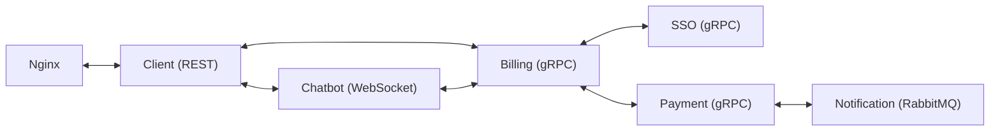

# Payment System
Микросервисная платежная система
> [!WARNING]
> Проект ещё находится в активной разработке и не все представленные функции реализованы
## Что уже готово?
#### 1. Payment Service(gRPC) - обрабатывает платежи, хранит транзакции:
- Создание платежа, получение информации о платеже, отмена платежа
- Отправка события в RabbitMQ при успешном платеже
- Кеширование платежей в Redis для быстрого доступа к информации через GET
#### 2. Notification Service - отправляет уведомления о платежах:
- Подписка на события платежей из RabbitMQ
- Отправка событий платежей(пока что в терминал, но планируется в веб-клиент, и заглушки для e-mail и sms)
#### 3. SSO(gRPC) - аутентификация
- Регистрация, авторизация, аутентификация, работа с пользователями, хэширование паролей, роли и права
- Создание токенов - **JWT** (Access + Refresh tokens) с подписью через **RSA**
#### 4. Billing Service(gRPC):
- Хранение истории платежей
- Валидация токена в interceptor(токен забирается из Metadata, который в всвою очередь туда попадает из HTTPonly cookies из сервиса Cilent)
- Взаимодействует с сервисами SSO, PAYMENT и CLIENT используя mTLS
#### 5. Client(REST)
- Взаимодействует с Billing
- Хранит токены при авторизации в HTTPonly cookies
- Swagger
- Поверх сервиса - прокси Ngnix, который переадресует http на https
#### 6. Postgres:
- Один образ, но несколько бд под каждый сервис(init скрипт который создаёт несколько бд при первом запуске контейнера)
- mTLS
- Сертификаты генерятся прямо в контейнере. Честно говоря выделяю это в минус, не очень безопасно, но как бы я не мучился с PowerShell у меня не вышло на Windows дать права сертификатам такие, какие хотел видеть Postgres. А на образе Linux, на котором стоит Postgres вполне себе, поэтому генерю там, а потом разшариваю другим сервисам через Volume. Не безопасно, но для Pet пусть будет так)
## Что в процессе разработки?
#### 0. Billing Service(gRPC):
- баги, нет реализации управления ролями
- тесты
#### 1. Payment Service(gRPC)
- тесты
- метрики
- возможно надо будет расширить возможности, но к созданию клиента уже будет видно что там и как
#### 2. SSO(gRPC) - аутентификация
- тесты
- пока что сервис никуда не интегрирован
- не прям всё написал, что хотел, но в целом все что прям надо для работы сервиса готово
- а ещё ничего не кешируется, но после клиента обязательно подвяжу Redis
#### 3. Client(REST)
- тесты
- веб-интерфейс
- автоматическое обновление Access токена
#### 4. Notification Service
- какой-то он пока худенький совсем, ничего не может, прям наносервис, но что-нибудь придумаю, может перейду на Kafka, для опыта)
#### 5. Chatbot(WebSocket) - вообще не готов пока:
- Общается с клиентом через WS, с другими сервисами — через gRPC
- Хранит историю в Postgres, кэш - Redis
## Схема взаимодействия сервисов

## Структура проекта
```
payment-system/  
├── proto/                  # Protobuf-контракты
├── services/  
│   ├── sso/                # SSO (gRPC)  
│   ├── payment/            # Платежи (gRPC)  
│   ├── notification/       # Уведомления (RabbitMQ)  
│   ├── billing/            # "оркестр" для sso-payment 
│   ├── chatbot/            # Чат-бот (WebSocket)  
│   └── client/             # Веб-клиент (REST)
├── docker-compose.yml      # Общий композ  
└── README.md
```
## Запуск
1. Сгенерировать сертификаты(Требуется установленый пакет go-task): 
```
cd scripts 
task all
```
2. Запустить docker compose:
```
docker compose up
```
## Модель базы данных
Добавлю позже, но кратко(без картинок) - в payment только табличка платежей, в sso таблички сессий, пользователей и ролей, а в billing - id пользователей и id платежей(один ко многим)
## А ещё...
Планирую покрыть весь проект тестами, добавить мониторинг, наверное, когда-нибудь... Плюс по безопасности всякие ограничения на колличество попыток доступа и все такое на последок оставил. А ещё хочу попробовать обернуть Zap logger, что использую тут, в Slog, чтоб была возможность легко интегрировать любой другой логер без рефакторинга всех сервисов, ну просто чтобы было) Ну а если будет время и совсем нечего делать, то может ещё и мобильный клиент запилю(или освою front и на React веб), но скорее уж какие-нибудь более функциональные сервисы придумаю, вроде инвистиций или чего-нибудь этакого из финтеха.
## Сабмодули какие-то...
Хотелось подчеркунуть микросервисность, и не делать весь Payment-System в одном репозитории, не хорошо это. А кучу микросервисов на GitHub держать непонятных что, откуда, тоже такое себе. Поэтому вот на помощь пришли Git Submoduls, очень удобно на самом деле, но колличество комитов пугает...