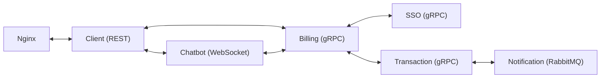

# 🪙 Transaction System
Микросервисная платежная система
> [!WARNING]
> Проект ещё находится в активной разработке и не все представленные функции реализованы
## 🎀 О проекте
Transaction System - маштабируемый и безопасный сервис моделирующий платёжные системы, построенный на основе микросервисной архитектуры. Система предоставляет инструметы для аутентификации пользователей, управления счетами и проведения транзакций (как внутренних, так и внешних).
Пользователям доступна работа с собственными счетами, внутренними и внешними транзакциями, конвертация валюты между счетами пользователей, история транзакций. Системные пользователи Support могут просматривать данные пользователей, отслеживать все проходящие транзакции и получать данные о необходимых пользователях и платежах. Администраторам доступна возможность завершать сессии пользователей, управлять правами пользователей, корректировать статусы транзакций, запрашивать возврат платежей.
## ⚙️ Стек технологий
- Golang, gRPC, REST, RabitMQ, WebSocket, PostgreSQL, Redis, Nginx, js
## 🛡️ Безопасность
- mTLS для шифрования трафика между всеми сервисами, включая соединения с базами данных
- ReBAC для управления доступом
- JWT для создания Access и Refresh токенов(планирую Refresh перевести на Opaque) 
- Blacklist tokens в Redis для отзыва токенов
- Argon2 для хэширования паролей
## 🧩 Что уже готово?
#### 0. Transaction Service(gRPC + RabbitMQ) - обрабатывает и хранит транзакции:
- Создание транзакции, получение информации о транзакции, отмена транзакции
- Отправка события в RabbitMQ при успешной транзакции
- Кеширование платежей в Redis для быстрого доступа к информации через GET
- Взаимодействие с Billing Service через gRPC
#### 1. Billing Service(gRPC) - работает с пользовательскими счетами:
- Создание и пополенние счетов, внутренние/внешние переводы, конвертация валюты
- Хранение истории операций
- Валидация токена в interceptor(токен забирается из Metadata, который в всвою очередь туда попадает из HTTPonly cookies из сервиса Cilent)
- Взаимодействе с сервисами SSO, Transaction и Client
#### 2. SSO(gRPC) - auth + ReBAC
- Авторизация, аутентификация
- Регистрация, работа с пользователями
- Хэширование паролей, управление токенами (Access + Refresh tokens)
- Управления правами с помощью системы отношейний(ReBAC)
#### 3. Client(REST + gRPC) - сервер для клиентского доступа
- Взаимодействует с Billing через gRPC
- Реализует REST эндпоинты для веб-интрефейса и Swagger документации
#### 4. Notification Service - отправляет уведомления о платежах:
- Подписка на события платежей из RabbitMQ
- Отправка событий транзакций
#### 5. Postgres:
- Один образ, но несколько бд под каждый сервис(init скрипт который создаёт несколько бд при первом запуске контейнера)
- Сертификаты генерятся прямо в контейнере. Честно говоря выделяю это в минус, не очень безопасно, но как бы я не мучился с PowerShell у меня не вышло на Windows дать права сертификатам такие, какие хотел видеть Postgres. А на образе Linux, на котором стоит Postgres вполне себе, поэтому генерю там, а потом разшариваю другим сервисам через Volume. Не безопасно, но для Pet пусть будет так)
#### 6. Nginx:
- Переадресация http запросов на https
- Обслуживание статик контента(веб-интерфейс)
## 🛠️ Что в процессе разработки?
#### 0. Chatbot(WebSocket) - вообще не готов пока
- Общается с Client через WS, с другими сервисами — через gRPC
- Хранит историю в Postgres, кэш - Redis
#### 1. Notification Service
- Планирую перехать на Apache Kafka
- Взаимодействие с Client для вывода уведомлений в интерфейс
- Ассинхронная работа с сообщениями
- Больше функционала
#### 2. SSO Service
- Ещё не добавил Redis кэш
- Хочу сделать ротацию токенов
#### 3. Billing, Transaction, SSO, Client Services:
- Тесты(очень жалею что не писал сразу(больше так не буду), но теперь иду доконца, обязательно хоть чуть покрою)
- Рефакторинг(писал как мог, буду подгонять под Effective Go) + нужно исправить логику ошибок(до веба иногда доходит мрак, с набором всех сервисов, через которые проходил запрос)
## 🧬 Схема взаимодействия сервисов

## 🗂️ Структура проекта
```
finance-system/  
├── proto/                  # Protobuf-контракты
├── security/               # Taskfile для генерации сертификатов + хранятся общие сертификаты
├── services/               # Сервисы
│   ├── sso/                # SSO (gRPC)  
│   ├── transaction/            # Платежи (gRPC)  
│   ├── notification/       # Уведомления (RabbitMQ)  
│   ├── billing/            # "оркестр" для sso-transaction 
│   ├── nginx/              # Прокси-сервер(конфиг), веб статика
│   ├── postgres/           # Скрипт для инициализации бд и конфиг
│   ├── chatbot/            # Чат-бот (WebSocket)  
│   └── client/             # Веб-клиент (REST)
├── docker-compose.yml      # Общий композ  
└── README.md
```
## 🚀 Запуск
0. Клонировать проект(Важно клонировать именно рекурсивно, чтобы подгрузить модули(При загрузке Zip архивом из GitHub модули так же не загружаются)):
```
git clone --recurse-submodules https://github.com/DarthanHawke/finance-system.git
```
1. Сгенерировать сертификаты(Требуется установленый пакет go-task): 
```
cd scripts 
task all
```
2. Запустить docker compose(Конечно же требуется Docker):
```
docker compose up
```
3. Досутп к веб интерфейсу: https://localhost (данные для входа в системные аккаунты хранятся в services/billing/.yaml.example)
4. Доступ к Swagger документации: https://localhost/swagger/index.html
## 🗄️ Модель базы данных
Добавлю позже, но кратко(без картинок) - в transaction только табличка платежей, в sso таблички сессий, пользователей и ролей, а в billing - id пользователей и id платежей(один ко многим)
## 🖥️ Веб-Интерфейс
[](https://postimg.cc/jLvrQyVv)
[](https://postimg.cc/NKJBYmpL)
[](https://postimg.cc/crdSnXzr)
[](https://postimg.cc/pmTM0yRv)
[](https://postimg.cc/2qgYLmpD)
[](https://postimg.cc/JtN809Pf)
[](https://postimg.cc/sBMy2xNm)
[](https://postimg.cc/1n6QpTPN)
[](https://postimg.cc/Lg3FW1J9)
[](https://postimg.cc/q6TdQLMD)
[](https://postimg.cc/21KRgmSZ)
[](https://postimg.cc/t1nQjfsm)
## 🪝 А ещё...
Планирую покрыть весь проект тестами, добавить мониторинг, наверное, когда-нибудь... Плюс по безопасности всякие ограничения на колличество попыток доступа и все такое на последок оставил. А ещё хочу попробовать обернуть Zap logger, что использую тут, в Slog, чтоб была возможность легко интегрировать любой другой логер без рефакторинга всех сервисов, ну просто чтобы было) Ну а если будет время и совсем нечего делать, то может ещё и мобильный клиент запилю(или освою front и на React веб), но скорее уж какие-нибудь более функциональные сервисы придумаю, вроде инвистиций или чего-нибудь этакого из финтеха.
## ⚖️ Сабмодули какие-то...
Хотелось подчеркунуть микросервисность, и не делать весь Finance-system в одном репозитории, не хорошо это. А кучу микросервисов на GitHub держать непонятных что, откуда, тоже такое себе. Поэтому вот на помощь пришли Git Submoduls, очень удобно на самом деле, но колличество комитов пугает...