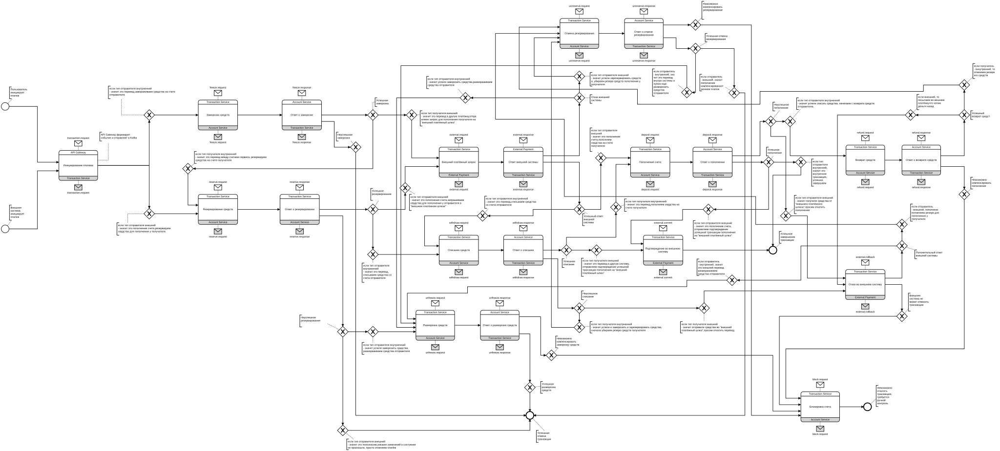
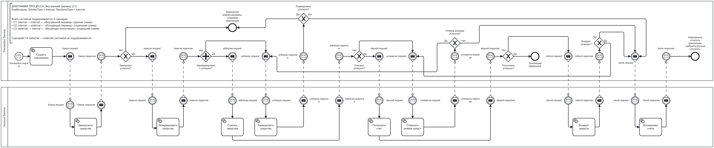
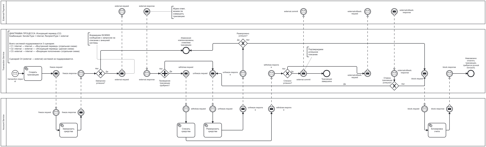
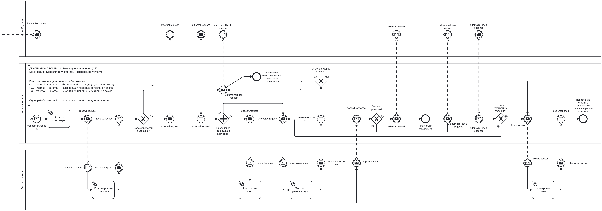

# Transaction System
Микросервисная платежная система
> [!WARNING]
> Проект ещё находится в активной разработке и не все представленные функции реализованы( p.s. А ещё я все переделал, но не все доделал, хех. Пока сделал только: Account Service(содержит данные счета, управляет счетом), Transaction Service(проводит транакции по саге), External Payment Service(на коленке собранная эмуляция внешней платежки, которая взаиммодействует с Transaction), и собственно Api-gateway чтоб все это тыкать. С предыдущей итерации проекта еще не перенес авторизацию, аутентификацию и управление ролями)
Зато вот bpmn схемки саги транзакций: хореография всей саги и отдельно три схемки для каждого типа платежа

