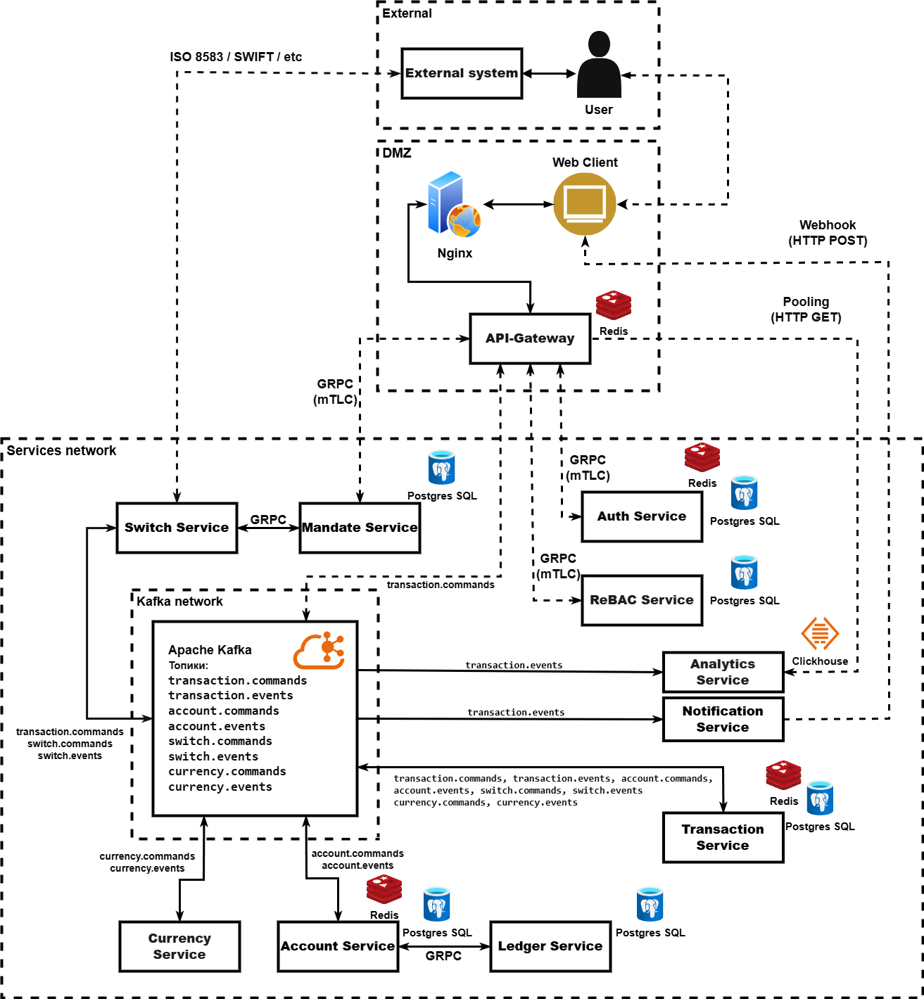
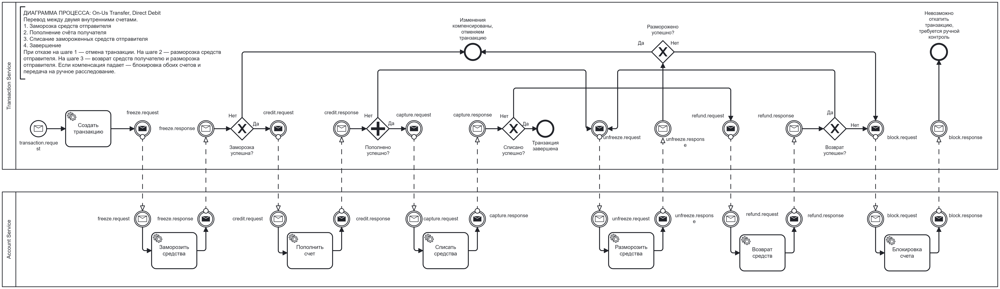
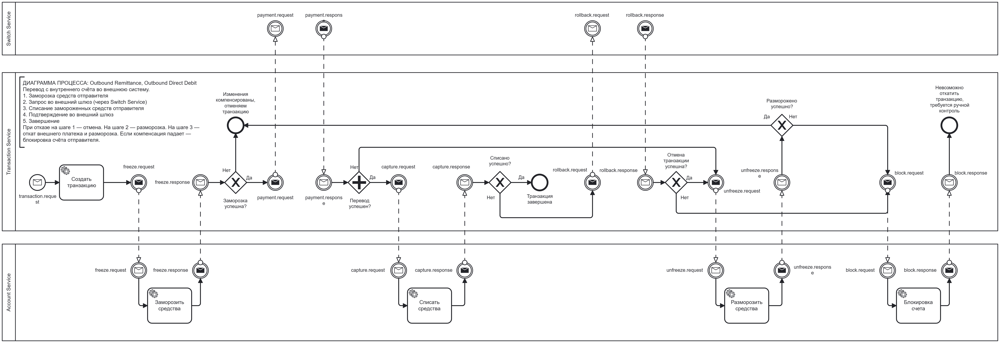
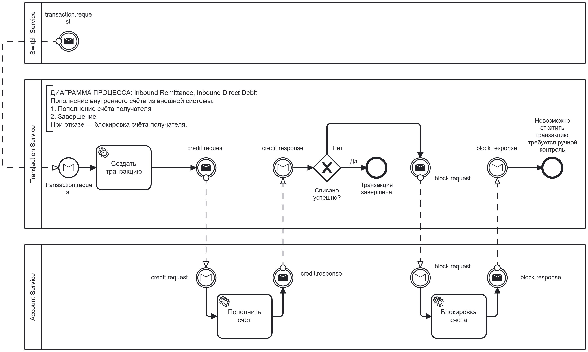
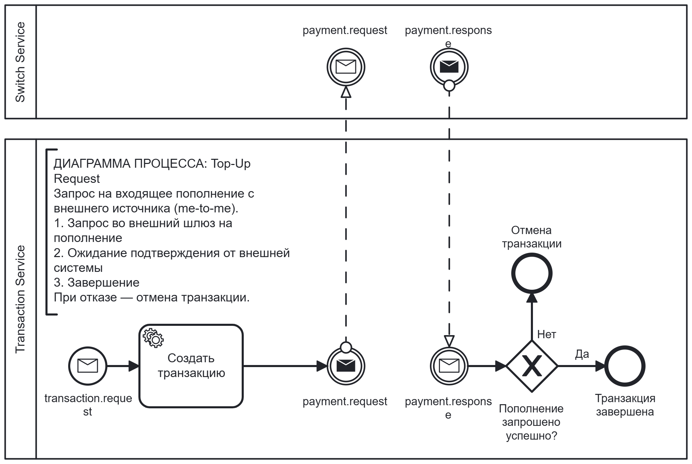

# Finance System

Микросервисная платежная система

> [!WARNING]

> Проект ещё находится в активной разработке и не все представленные функции реализованы.
> P.s. это уже третья итерация данного проекта, снова все пересобираю, потому много чего ещё не готово(хотя оно присутствовало в старых решениях). Сейчас я закончил рефактор ядра, на очереди работа со счетом, проводки, сервис аналитики, Api-gateway, проводки, и уже дальше буду наращивать функции и тестировать под нагрузкой. 

## Содержание
- [Архитектура проекта](#архитектура-проекта)
  - [Transaction Service](#transaction-service)
  - [Account Service](#account-service)
  - [Switch Service](#switch-service)
  - [Analytics Service](#analytics-service)
  - [Ledger Service](#ledger-service)
  - [Currency Service](#currency-service)
  - [API Gateway](#api-gateway)
  - [Auth Service](#auth-service)
  - [ReBAC Service](#rebac-service)
- [Схема транзакций](#схема-транзакций)
  - [On-Us Transfer](#on-us-transfer)
  - [Outbound Remittance](#outbound-remittance)
  - [Inbound Remittance](#inbound-remittance)
  - [Top-Up Request](#top-up-request)
  - [Refund](#refund)
  - [Chargeback](#chargeback)
  - [Adjustment](#adjustment)
- [Топики Kafka](#топики-kafka)
- [Отказоустойчивость, идемпотентность, масштабируемость](#отказоустойчивость-идемпотентность-масштабируемость)
- [Дальнейшие планы](#дальнейшие-планы)

## Архитектура проекта

### Transaction service
Ядро системы. Получает команды на создание платежа, строит сагу по типу транзакции, порождает события для Account Service и Switch Service, собирает ответы и продвигает сагу по состояниям. 
При сбое на любом шаге запускается цепочка компенсаций. Если компенсация тоже падает - счета блокируются, транзакция уходит в BLOCKED и передаётся администратору.
Outbox-процессор гарантирует, что ни одно событие не потеряется между БД и Kafka. Consumer фильтрует дубликаты через Redis и обрабатывает только новые события.
### Account service
Управляет балансом в конкурентной среде. Баланс разделён на две части:
- `balance` - доступный остаток
- `frozen_balance` - средства, замороженные под списание
Это позволяет безопасно работать с деньгами, не блокируя счёт целиком. Пессимистичные блокировки на уровне Postgres (`FOR UPDATE`) гарантируют, что две операции не изменят одну строку одновременно - вторая встанет в очередь и увидит актуальный баланс.
### Switch Service
Если покопаться в старых комитах, раньше он назывался External Payment Service и делал он не очень то даже понятно что: это была просто заглушка для имитации внешних платежных систем.
Теперь это полноценный платёжный шлюз для взаимодействия с внешними платёжными системами, который поддерживает несколько форматов(swift/iso/мир) и умеет принимать такие сообщения и передавать их в Transaction в нужной форме, так и в обратную сторону, паковать сообщения из Transaction в нужный формат и отправлять их во внешние системы.
Для тестирования Switch планирую эмулировать поведение внешних шлюзов: успешное проведение, отказ по разным кодам, таймауты, нестабильные соединения. Это позволит прогонять полные сценарии саг без подключения к реальным банкам.
Пока что ещё не добрался до этого сервиса и его рефактора.
### Analytics Service
Собирает события жизненного цикла транзакций: создание, завершение, отмена, блокировка. Слушает `transaction.events` и строит витрину для пользовательского интерфейса и бизнес-отчётности. Не участвует в платёжном процессе - только читает.
Пока что не реализован(раньше этим занимался сам Transaction, теперь логику от туда вынес, и скоро дойду до этого сервиса).
### Ledger Service
Хранит проводки - записи о движении средств по счетам. Каждая операция Account Service (заморозка, списание, пополнение) порождает проводку, которая пишется в Ledger. Это аудиторский след: всегда можно восстановить, кто, кому, когда и на каком основании перевёл деньги.
Тоже в активной разработке.
### Currency service
Пока отсутствует. Сервис будет конверировать средства из разных валют в одну для перводов в разных валютах
### Api-gateway
Точка входа, которая безопасно дает доступ к сервисам. Ну пока ещё не безопасно, об этом ниже)
### Auth service
Сервис отвечающий за авторизацию и аутентификацию. Он уже был реализован в предыдущей версии проекта(где не было брокера сообщений, и были некоторые ошибки в архитектуре), и даже можно было бы посмотреть на реализацию в комите e55db54 от 21 августа 25 года, если бы я не использовал GitSubmoduls для своих микросервисов, и коммит не содержал лишь ссылку на репозиторий, который ныне до переработки закрыт. Собвтсенно дело было давно, но сервис использовал JWT токены, хешировал пароли, работал с Redis для создания BlackList для отзыва токенов. Собираюсь сделать его слабосвязанным, дабы можно было таскать его и по другим своим проектам. Хотя вернее будет сказать, хочу сделать либу для своих auth сервисов, чтобы быстро и просто разворачивать данный сервис в своих петах. Пока что в разработке.
### ReBAC service
Абсолютно такая же история как и с Auth сервисом. Сервис представляет собой реализацую управления ролями с помощью системы отношейний между субъектом и ресурсом. Выбран именно этот способ контроля доступа, т.к. я не хотел использовать сторонние либы, и в выборе подхода к реализации управления ролями этот показался самым интересным, менее душным, при этом в какой-то мере более продвинутым и сложным, так ещё и вполне не плохо ложился на мою систему. В разработке.

Веба пока что нет. Опять же он был в старом варианте. Как доберусь до него, так побалуюсь.
Собственно это пока что все сервисы, что предоставляет данный проектик. Есть и ещё идейки с чем я хотел бы поработать, и что дополнило бы его, но и до этого есть ещё незавершённые таски.

## Схема транзакций
Каждый тип транзакции - это отдельная сага со своей картой переходов. Ниже перечислены все поддерживаемые типы.
### On-Us Transfer, Direct Debit
Перевод между двумя внутренними счетами.

1. Заморозка средств отправителя
2. Пополнение счёта получателя
3. Списание замороженных средств отправителя
4. Завершение
При отказе на шаге 1 - отмена транзакции. На шаге 2 - разморозка средств отправителя. На шаге 3 - возврат средств получателю и разморозка отправителя. Если компенсация падает - блокировка обоих счетов и передача на ручное расследование.
### Outbound Remittance, Outbound Direct Debit
Перевод с внутреннего счёта во внешнюю систему.

1. Заморозка средств отправителя
2. Запрос во внешний шлюз (через Switch Service)
3. Списание замороженных средств отправителя
4. Подтверждение во внешний шлюз
5. Завершение
При отказе на шаге 1 - отмена. На шаге 2 - разморозка. На шаге 3 - откат внешнего платежа и разморозка. Если компенсация падает - блокировка счёта отправителя.
### Inbound Remittance, Inbound Direct Debit
Пополнение внутреннего счёта из внешней системы.

1. Пополнение счёта получателя
2. Завершение
При отказе - блокировка счёта получателя (Технически, отказ не возможен, если счет разблокирован. Но при пополнении при невозомжности начислить средства, счет временно блокируется и операция направляется к администраторам для ручного расследования/проведения возврата).
### Top-Up Request
Запрос на входящее пополнение с внешнего источника (me-to-me).

1. Запрос во внешний шлюз на пополнение
2. Ожидание подтверждения от внешней системы
3. Завершение
При отказе - отмена транзакции.
### Refund
Возврат по ранее выполненной транзакции. Тип саги зависит от типа родительской транзакции.
#### Refund Internal - возврат по внутреннему переводу.
1. Пополнение счёта отправителя (возврат денег)
2. Списание с получателя
3. Завершение
При отказе на любом шаге - блокировка соответствующего счёта.
#### Refund Outbound - возврат по исходящему переводу.
1. Пополнение счёта отправителя (внешняя сторона уже вернула деньги)
2. Завершение
При отказе - блокировка счёта отправителя.
#### Refund Inbound - возврат по входящему пополнению.
1. Списание с получателя
2. Запрос во внешний шлюз на возврат
3. Завершение
При отказе на любом шаге - блокировка счёта получателя.
### Chargeback
Принудительный возврат, инициированный внешней системой. Структурно аналогичен Refund, но инициатор - не клиент, а внешняя сторона (банк-эмитент, платёжная система).
#### Chargeback Internal - чарджбек по внутреннему переводу.
1. Списание с получателя
2. Пополнение отправителю
3. Завершение
При отказе на любом шаге - блокировка соответствующего счёта.
#### Chargeback Outbound - чарджбек по исходящему переводу.
1. Пополнение счёта отправителя
2. Завершение
При отказе - блокировка счёта отправителя.
#### Chargeback Inbound - чарджбек по входящему пополнению.
1. Списание с получателя
2. Запрос во внешний шлюз
3. Завершение
При отказе на любом шаге - блокировка счёта получателя.
### Adjustment
Административная операция корректировки баланса. Выполняется в один шаг.
#### Adjustment Credit - пополнение счёта.
1. Пополнение счёта получателя
2. Завершение
При отказе - блокировка счёта получателя.
#### Adjustment Debit - списание со счёта.
1. Списание со счёта получателя
2. Завершение
При отказе - блокировка счёта получателя.

## Топики Kafka
| Топик                  | Назначение                                                                             |
| ---------------------- | -------------------------------------------------------------------------------------- |
| `transaction.commands` | Входящие команды для Transaction Service: создание платежа, ответы от Account и Switch |
| `transaction.events`   | Исходящие события жизненного цикла транзакций для Analytics Service                    |
| `account.commands`     | Команды Account Service: freeze, unfreeze, credit, debit, capture, block               |
| `account.events`       | Ответы Account Service                                                                 |
| `switch.commands`      | Команды Switch Service: внешний платёж, commit, rollback                               |
| `switch.events`        | Ответы Switch Service                                                                  |
| `dlq`                  | Dead Letter Queue - сообщения, не обработанные после всех попыток                      |

## Отказоустойчивовть, идемпотентность, маштабируемость
Идемпотентность гарантируется на уровне базы данных уникальным constraint в таблице событий - повторное событие просто не запишется; дополнительно перед обработкой сообщения проверяется Redis, чтобы отсечь дубликаты ещё до запроса в БД и снизить нагрузку на сервисы.

Гонка потоков при параллельных списаниях с одного счёта разрешается за счёт того, что уровень изоляции транзакций в Postgres (Read Committed + явные пессимистичные блокировки строк) не позволяет двум операциям одновременно изменить одну и ту же строку счёта - вторая операция встаёт в очередь и видит уже обновлённый баланс после первой.

Отправка событий в Kafka защищена паттерном Outbox: событие пишется в ту же таблицу и в той же транзакции, что и бизнес-данные, а фоновый процесс периодически выгребает неподтверждённые события и отправляет их в брокер - это гарантирует, что событие не потеряется при падении сервиса между шагами. Если сообщение не удалось обработать даже после нескольких попыток с экспоненциальной задержкой, оно попадает в Dead Letter Queue, чтобы не забивать очередь и не мешать другим сообщениям.

Порядок операций в транзакции гарантируется ключем по которому операции с одного счета становятся в очередь в одной партиции. Это снижает пропускную способность для операций с одного счета(но у нас тут и не брокерская система, чтоб с одного счета тысячи операций делать), но общая пропускная способность сервиса не страдает.

Пока это все что я вспомнил, что касается этой темы и уже реализовано. Позже сделаю и health check'и, и возможность сервсам самостоятельно востанавливаться после отказа, и возможность наоборот отклюючаться от проблемных узлов(circuit breaker), ещё подумаю как, зачем и что можно сделать

## Дальнейшие планы
- Завершить Analytics Service и Ledger Service, сделать рефактор Account Service, Api-Gateway и Extrenal Payment Service; завершить Auth
- Добавить health-check'и и автоматическое восстановление после сбоев
- CI/CD пайплайн
- Нагрузочное тестирование
- Переезд в Kubernetes и эксперименты с горизонтальным масштабированием
